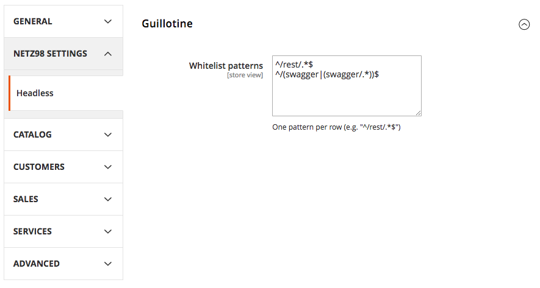

# N98_Guillotine

A simple but useful module to disable frontend requests to implement a headless approch.

## Installation

```bash

# Install module using composer
composer require n98/headless-guillotine

# Enable the module
bin/magento module:enable N98_Guillotine

# Upgrade Magento
bin/magento setup:upgrade

```

## Configuration

To add or edit a whitelist entry, simply navigate to the system configuration and modify the patterns to match your needs:


